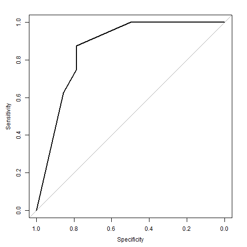
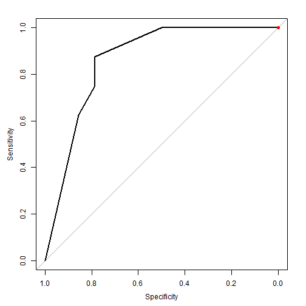
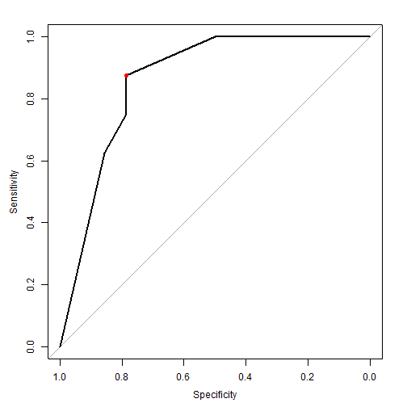
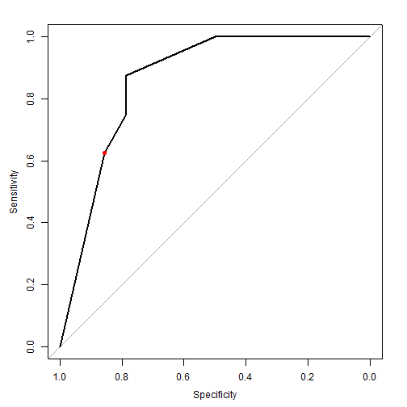

# Overview

1. Quickly build a classifier
2. Extremely high level definition of an ROC curve
3. Definition of utility in economics
4. Learn how to set ROC thresholds based on maximizing utility


# The Use Case

In this use case, imagine you are a movie theater owner. You decide to increase movie ticket sales, you want to build an app to recommend movies to your loyal customers.

The following is the top few rows of a dataset for one customer. 0 means the customer did not like that movie and 1 means the customer did. We are just going to take the ROC curve for this one person and then figure out what the optimal threshold is. 

**Prereqs to run the code**

- Requires `RevoScaleR` package
- `install.packages("tidyverse")`
- `install.packages("pROC")`


```
##                original_title    Genre1 rating
## 1                   Toy Story Animation      1
## 2                     Jumanji Adventure      1
## 3            Grumpier Old Men   Romance      0
## 4           Waiting to Exhale    Comedy      1
## 5 Father of the Bride Part II    Comedy      0
## 6                        Heat    Action      0
```


# Build a classifier

We'll just use a logistic regression model


```r
form = rating ~ Genre1
model = rxLogit(form, train)
```


```r
prediction <- rxPredict(model, test) 
test_results <- cbind(test, prediction) %>% subset(select = -c(1,2,id, keywords))
```


```r
roc_data <- select(test_results, Genre1, rating, rating_Pred)
roc_data
```

```
##             Genre1 rating  rating_Pred
## 1           Comedy      1 8.846154e-01
## 2            Drama      0 1.891892e-01
## 3          Romance      0 1.102390e-08
## 4           Action      0 1.818182e-01
## 5           Comedy      1 8.846154e-01
## 6         Thriller      0 1.102390e-08
## 7            Crime      0 1.102390e-08
## 8           Comedy      1 8.846154e-01
## 9           Comedy      0 8.846154e-01
## 10         Fantasy      1 8.000000e-01
## 11         Fantasy      0 8.000000e-01
## 12           Drama      1 1.891892e-01
## 13           Drama      0 1.891892e-01
## 14     Documentary      0 1.102390e-08
## 15           Drama      0 1.891892e-01
## 16          Comedy      1 8.846154e-01
## 17          Comedy      0 8.846154e-01
## 18 Science Fiction      0 1.102390e-08
## 19          Comedy      1 8.846154e-01
## 20       Adventure      1 5.000000e-01
## 21         Romance      0 1.102390e-08
## 22           Drama      0 1.891892e-01
```


# Evaluate the classifier


### Describing the ROC curve

We have an ROC curve which tells us how well our model can detect if a movie will be liked by a customer or not.


1. **True positive (TP)**: Good movie correctly identified as good
2. **False positive (FP)**: Bad movie incorrectly identified as good
3. **True negative (TN)**: Bad movie correctly identified as bad
4. **False negative (FN)**: Good movie incorrectly identified as bad
5. **Sensitivity**: TP/(TP+FN), true positive rate
6. **Specificity**: TN/(TN+FP), true negative rate
7. **False positive rate** = 1 - specificity


```r
roc_obj = roc(roc_data$rating, roc_data$rating_Pred)
roc_obj
```

```
## 
## Call:
## roc.default(response = roc_data$rating, predictor = roc_data$rating_Pred)
## 
## Data: roc_data$rating_Pred in 14 controls (roc_data$rating 0) < 8 cases (roc_data$rating 1).
## Area under the curve: 0.8616
```

```r
plot(roc_obj)
```



1. **High sensitivity, low specificity**: Many false positives, top right part of ROC curve
2. **High specificity, low sensitivity**: Many false negatives, bottom left part of ROC curve


The top right part means the model would generate a ton of false positives and recommend movies to the customer that the customer may not like in addition to movies the customer will like. The model is pretty optimistic about all movies.  

The bottom left part means the model would filter out any movies it doesn't remotely think the customer would like, and only give out movies it is certain about it. However, it may fail to recommend movies that a customer might have actually liked! We can say that the model is very picky.

# Utility

**Utility** - an economic term which refers to the satisfaction or benefit a person derives from a good or service

Utility comes in when we want to figure out where we want to set our threshold for our ROC curve. Getting the optimum threshold means finding the threshold on the ROC which maximizes utility. To maximize utility, we need to minimize the cost. 


### From the movie business standpoint

- Failing to recommend a good movie costs $9.00 per customer. In other words, this is setting a cost on high specificities.


```r
cost1 = 9

cost = cost1*(1-roc_obj$sensitivities)
threshold_cost_table = data.frame(sensitivity = roc_obj$sensitivities, specificity = roc_obj$specificities, cost)
threshold_cost_table[order(threshold_cost_table$cost),]
```

```
##    sensitivity specificity  cost
## 1        1.000  0.00000000 0.000
## 2        1.000  0.07142857 0.000
## 3        1.000  0.28571429 0.000
## 4        1.000  0.35714286 0.000
## 5        1.000  0.42857143 0.000
## 6        1.000  0.50000000 0.000
## 7        0.875  0.78571429 1.125
## 8        0.750  0.78571429 2.250
## 9        0.625  0.85714286 3.375
## 10       0.000  1.00000000 9.000
```

```r
cost_line = threshold_cost_table[head(order(threshold_cost_table$cost), 1),]%>% select(sensitivity,specificity)
plot(roc_obj) 
points(cost_line$specificity, cost_line$sensitivity, col = "red", pch = 19)
```




Let's assume now that there is a cost to recommending a bad movie - **10.00 dollars**. 

6.00 out of the 10.00 dollars is because 2/3 of your customers aren't interested in your recommendation and don't buy your 9.00 dollar ticket. The other 4.00 dollars happens in case a fraction of them of them tell their friends that the recommendation of your app sucks, so it's the cost of a worse reputation.


```r
cost1 = 9
cost2 = 10
cost = cost1*(1-roc_obj$sensitivities) + cost2*(1-roc_obj$specificities)
threshold_cost_table = data.frame(sensitivity = roc_obj$sensitivities, specificity = roc_obj$specificities, cost)
threshold_cost_table[order(threshold_cost_table$cost),]
```

```
##    sensitivity specificity      cost
## 7        0.875  0.78571429  3.267857
## 8        0.750  0.78571429  4.392857
## 9        0.625  0.85714286  4.803571
## 6        1.000  0.50000000  5.000000
## 5        1.000  0.42857143  5.714286
## 4        1.000  0.35714286  6.428571
## 3        1.000  0.28571429  7.142857
## 10       0.000  1.00000000  9.000000
## 2        1.000  0.07142857  9.285714
## 1        1.000  0.00000000 10.000000
```

```r
cost_line = threshold_cost_table[head(order(threshold_cost_table$cost), 1),]%>% select(sensitivity,specificity)
plot(roc_obj) 
points(cost_line$specificity, cost_line$sensitivity, col = "red", pch = 19)
```




### From the User's Standpoint

Let's see what kind of recommendation the app-user would have to maximize his/her utility.

1. The cost of going to the movie is 9 dollars, so going to a bad movie is 9 dollars lost.
2. Each hour of the user is worth 3 dollars, so if the movie was 2 hours on average, this is about 6 dollars.
3. The emotional pain of the user having seen the bad movie is worth 2 more dollars
4. Missing a movie the user would have liked might cost 4 dollars of the emotional struggle of having to deal with all of the user's friends having watched the movie - also known as FOMO.


```r
cost1 = 4
cost2 = 9+6+2
cost = cost1*(1-roc_obj$sensitivities) + cost2*(1-roc_obj$specificities)
threshold_cost_table = data.frame(sensitivity = roc_obj$sensitivities, specificity = roc_obj$specificities, cost)
threshold_cost_table[order(threshold_cost_table$cost),]
```

```
##    sensitivity specificity      cost
## 9        0.625  0.85714286  3.928571
## 10       0.000  1.00000000  4.000000
## 7        0.875  0.78571429  4.142857
## 8        0.750  0.78571429  4.642857
## 6        1.000  0.50000000  8.500000
## 5        1.000  0.42857143  9.714286
## 4        1.000  0.35714286 10.928571
## 3        1.000  0.28571429 12.142857
## 2        1.000  0.07142857 15.785714
## 1        1.000  0.00000000 17.000000
```

```r
cost_line = threshold_cost_table[head(order(threshold_cost_table$cost), 1),]%>% select(sensitivity,specificity)
plot(roc_obj) 
points(cost_line$specificity, cost_line$sensitivity, col = "red", pch = 19)
```




Therefore this user would be happy with a recommender of higher specificity, but that isn't in the theater's best interests. 

Credit to http://blog.mldb.ai/blog/posts/2016/01/ml-meets-economics/


